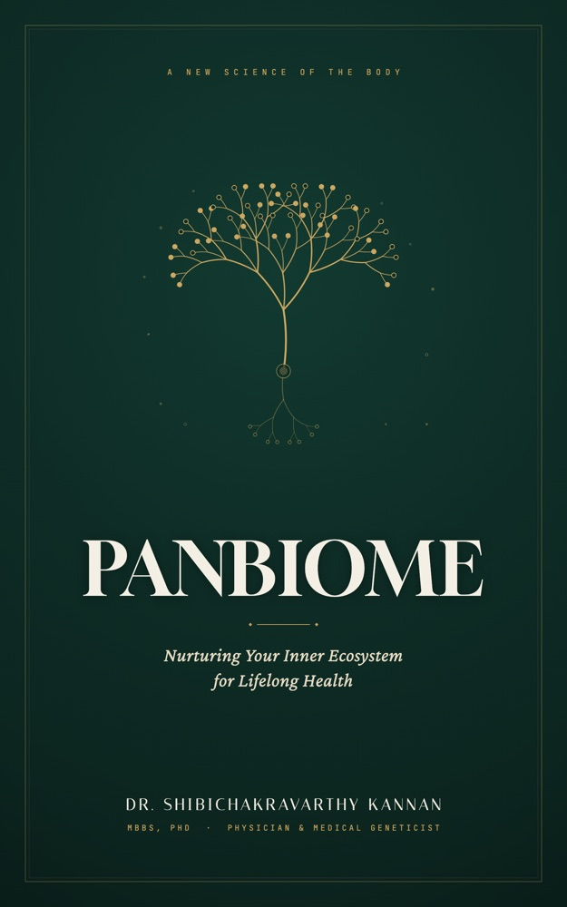

# PANBIOME: Nurturing Your Inner Ecosystem for Lifelong Health

<div align="center">
  

  <br><br>

  [](https://www.amazon.in/dp/B0H5BPJ8D7)
  [](https://musicofthings.github.io/panbiome/)
  [](https://musicofthings.github.io/panbiome/#author)

  <p><em>"You are not just you. You are a living superorganism — and this is the physician's guide to restoring that ancient partnership."</em></p>
</div>

---

## 🛒 Buy on Amazon

*PANBIOME* is published worldwide on Amazon KDP in both **Paperback** and **Kindle eBook** editions:

| Format | ASIN | Amazon India | Amazon Worldwide / US |
| :--- | :--- | :--- | :--- |
| 📖 **Paperback Edition** | `B0H5BPJ8D7` | [**Order on Amazon.in**](https://www.amazon.in/dp/B0H5BPJ8D7) | [**Order on Amazon.com**](https://www.amazon.com/dp/B0H5BPJ8D7) |
| 📱 **Kindle eBook Edition** | `B0H592WT5G` | [**Buy Kindle on Amazon.in**](https://www.amazon.in/dp/B0H592WT5G) | [**Buy Kindle on Amazon.com**](https://www.amazon.com/dp/B0H592WT5G) |

---

## 🌐 Live Web Companion & Pages

- **Official Landing Page:** [https://musicofthings.github.io/panbiome/](https://musicofthings.github.io/panbiome/)
- **Free International Recipe Companion & 30-Plant Tracker (36 Recipes):** [https://musicofthings.github.io/panbiome/PANBIOME_Recipe_Book.html](https://musicofthings.github.io/panbiome/PANBIOME_Recipe_Book.html) — includes interactive 30-plant weekly tracker, dynamic serving scaler, 7-day reset schedule, and categorized shopping list.

---

## 📖 About the Book

Inside and on your body live tens of trillions of microbes — roughly matching your own human cells in number and carrying more than a hundred times as many genes. Together they form what this book defines as the **Panbiome**: your gut, skin, mouth, respiratory tract, and reproductive tract working as one connected, living system.

Written by medical geneticist and diagnostics physician **Dr. Shibichakravarthy Kannan, MBBS, PhD**, *PANBIOME* explains the revolutionary science of your microbiome, why modern lifestyles erode it, and provides a clear, food-first roadmap to restore it in weeks.

### Key Highlights
- **18 Core Chapters + 2 Specialized Clinical Chapters:**
  - **Part I: The Hidden World** — The superorganism, gut-brain second brain, immunity, and microbial metabolism.
  - **Part II: The Modern Trap** — Ultra-processed foods, antibiotic overuse, stress, circadian disruption, and the hygiene paradox.
  - **Part III: The Protocol** — The 30-plant weekly biodiversity challenge, a practical 7-Day Gut Reset, your personal Panbiome Dashboard, and evidence-based supplement guidance.
  - **Part IV: The Future** — Next-decade personalized microbiome medicine and longevity lessons from traditional diets.
  - **Special Chapters** — The female microbiome and the critical first 1,000 days of microbial colonization.
- **Rooted in Culinary Heritage:**
  - Integrates the wisdom of South Indian fermented batters and digestive spices, Mediterranean polyphenol-rich cold-pressed olive oils, and Okinawan prebiotic seaweeds and fermented misos.

---

## 🍲 The Free Recipe Companion

The repository hosts an interactive 24-recipe companion guide translating microbiome science directly to your kitchen:

- **8 South Indian Dishes** (fermented dosas, idlis, spiced rasam, mor kuzhambu, pachadi)
- **8 Mediterranean Dishes** (extra-virgin olive oil infusions, legume stews, wild greens, fermented dips)
- **8 Okinawan Dishes** (fucoidan-rich seaweeds, champuru, miso-glazed roasted root vegetables, bitter melon)

Readers can access the full companion anytime at [PANBIOME Recipe Book](https://musicofthings.github.io/panbiome/PANBIOME_Recipe_Book.html).

---

## 👨‍⚕️ About the Author

**Dr. Shibichakravarthy Kannan, MBBS, PhD**  
*Medical Geneticist & Diagnostics Specialist · Hyderabad, India*

Dr. Kannan is a physician-scientist, entrepreneur, and computational biologist working at the intersection of genomics, data science, and microbiome health. His clinical and diagnostic work in Hyderabad inspired this book after observing countless patients with "normal" routine lab results who continued to suffer from chronic digestive, metabolic, and systemic health challenges.

- **Email:** shibi.kannan@gmail.com
- **Landing Page:** [Dr. Kannan's Author Profile](https://musicofthings.github.io/panbiome/#author)

---

## 📁 Repository Structure

```text
panbiome/
├── index.html                  # Official Book Landing Page (GitHub Pages root)
├── PANBIOME_Recipe_Book.html   # Free 24-Recipe International Companion
├── cover-web.jpg               # Web-optimized front cover art
├── PANBIOME_Cover.png          # High-resolution original cover illustration
├── README.md                   # Repository documentation & publication links
├── CLAUDE.md                   # Project context, style guide, & science rules
└── .gitignore                  # Excludes private manuscripts, DOCX, & build drafts
```

---

## ⚖️ Medical Disclaimer

*PANBIOME* and its companion web pages are published for educational and informational purposes only. They do not constitute formal medical diagnosis, treatment, or medical advice. Patient vignettes represent composite clinical cases. Always consult your qualified physician or healthcare provider before making significant dietary, lifestyle, or medical changes.

---

<div align="center">
  <p>© 2026 Dr. Shibichakravarthy Kannan · <em>PANBIOME</em> · All Rights Reserved.</p>
</div>
